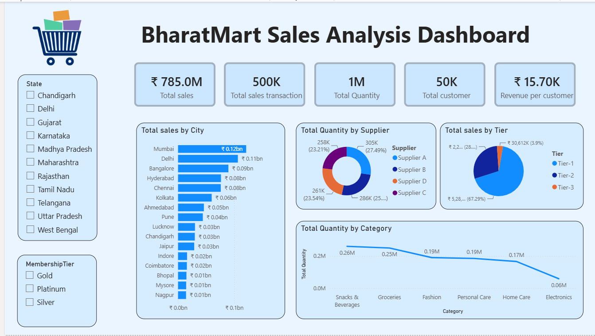

# 📊 BharatMart Sales Analysis Dashboard


---

## 📌 Project Overview

**BharatMart Sales Analysis Dashboard** is an interactive **Power BI business intelligence project** designed to analyze sales performance across cities, suppliers, product categories, customer tiers, states, and membership segments.

The project transforms sales transaction data into meaningful business KPIs and interactive visualizations to help stakeholders understand:

- Sales performance
- Geographic sales distribution
- Customer segmentation
- Supplier contribution
- Product-category demand
- Revenue per customer
- Transaction performance

The dashboard is designed to provide an **executive-level view of BharatMart's sales performance** and support data-driven business decisions.

---

## 🎯 Business Objective

The primary objective of this project is to build an interactive sales analytics dashboard that enables business stakeholders to:

- Monitor overall sales performance
- Identify high-performing cities
- Analyze sales across customer tiers
- Understand supplier contribution
- Compare product-category demand
- Analyze customer membership segments
- Evaluate state-level sales performance
- Track important business KPIs
- Identify areas for further business analysis

---

## 🖼️ Dashboard Preview

## 📸 Dashboard Preview

<p align="center">
  
</p>

---

## 📊 Key Performance Indicators

| KPI | Value |
|---|---:|
| 💰 Total Sales | ₹785.0M |
| 🛒 Sales Transactions | 500K |
| 📦 Total Quantity | 1M |
| 👥 Total Customers | 50K |
| 💵 Revenue per Customer | ₹15.70K |

> **Note:** KPI values represent the dashboard snapshot included in this repository.

---

# 📈 Dashboard Analysis

## 1. Total Sales by City

The **Total Sales by City** visual ranks cities according to their sales contribution.

### Cities Included

- Mumbai
- Delhi
- Bangalore
- Hyderabad
- Chennai
- Kolkata
- Ahmedabad
- Pune
- Lucknow
- Chandigarh
- Jaipur
- Indore
- Coimbatore
- Bhopal
- Mysore
- Nagpur

### Key Observation

Mumbai records the highest sales among the cities displayed in the dashboard, followed by Delhi and Bangalore.

This analysis can help identify high-performing geographic markets and support regional sales planning.

---

## 2. Total Quantity by Supplier

The **Total Quantity by Supplier** donut chart analyzes product quantity contributed by different suppliers.

### Suppliers

- Supplier A
- Supplier B
- Supplier C
- Supplier D

This analysis provides visibility into supplier contribution and product-volume distribution.

---

## 3. Total Sales by Customer Tier

The dashboard segments sales across three customer tiers:

- **Tier-1**
- **Tier-2**
- **Tier-3**

This segmentation helps analyze how different customer-market tiers contribute to overall sales.

---

## 4. Total Quantity by Category

The dashboard analyzes total quantity across the following product categories:

- Snacks & Beverages
- Groceries
- Fashion
- Personal Care
- Home Care
- Electronics

### Key Observation

Snacks & Beverages and Groceries show some of the highest displayed quantity levels, while Electronics shows the lowest displayed quantity among the categories shown.

> Quantity and revenue should be analyzed separately because high product volume does not necessarily mean the highest revenue or profitability.

---

# 🎛️ Interactive Dashboard Filters

The dashboard contains interactive slicers that allow users to dynamically filter the analysis.

## State Filter

Users can filter the dashboard by:

- Chandigarh
- Delhi
- Gujarat
- Karnataka
- Madhya Pradesh
- Maharashtra
- Rajasthan
- Tamil Nadu
- Telangana
- Uttar Pradesh
- West Bengal

---

## Membership Tier Filter

Users can analyze customer performance by:

- 🥇 Gold
- 💎 Platinum
- 🥈 Silver

These filters allow users to perform detailed geographic and customer-segment analysis.

---

# 🔍 Key Business Questions

The dashboard helps answer the following business questions:

1. What is the total sales generated?
2. How many transactions were completed?
3. How many customers are represented?
4. Which cities generate the highest sales?
5. Which suppliers contribute the highest quantity?
6. Which customer tier contributes the most sales?
7. Which product categories have the highest quantity?
8. How does sales performance vary by state?
9. How does membership tier affect sales performance?
10. What is the average revenue generated per customer?

---

# 🧮 DAX Measures

The following DAX measures are used or recommended for the dashboard.

## Total Sales

```DAX
Total Sales =
SUM(FactSales[SalesAmount])


Total Transactions
Total Transactions =
DISTINCTCOUNT(FactSales[TransactionID])
Total Quantity
Total Quantity =
SUM(FactSales[Quantity])
Total Customers
Total Customers =
DISTINCTCOUNT(FactSales[CustomerID])
Revenue per Customer
Revenue per Customer =
DIVIDE(
    [Total Sales],
    [Total Customers],
    0
)
Average Transaction Value
Average Transaction Value =
DIVIDE(
    [Total Sales],
    [Total Transactions],
    0
)
Average Quantity per Transaction
Average Quantity per Transaction =
DIVIDE(
    [Total Quantity],
    [Total Transactions],
    0
)

💡 Business Insights

Based on the dashboard snapshot:

Total sales are approximately ₹785M.
The business recorded approximately 500K transactions.
Total quantity sold is approximately 1M units.
The analysis covers approximately 50K customers.
Revenue per customer is approximately ₹15.70K.
Mumbai is the highest-sales city shown in the dashboard.
Delhi and Bangalore are also among the leading cities.
Snacks & Beverages and Groceries have high displayed quantities.
Electronics has the lowest displayed quantity among the displayed categories.
Sales performance can be further analyzed using State and Membership Tier filters.


